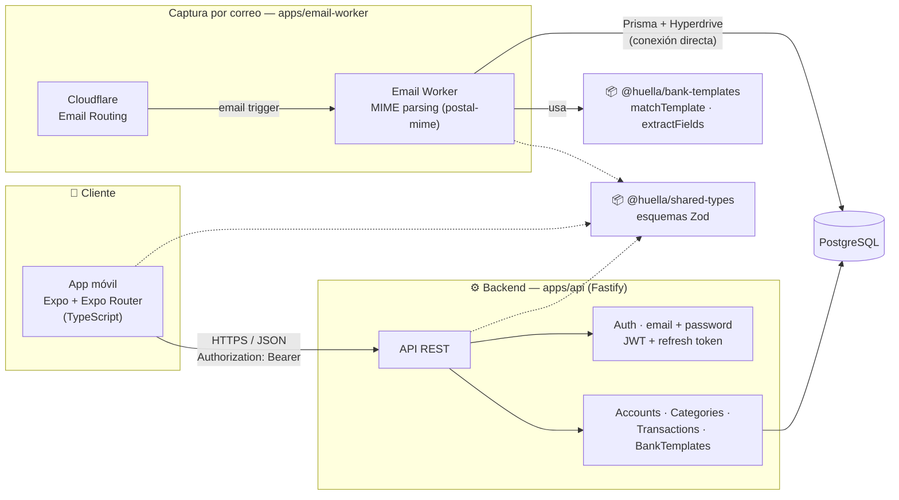

<div align="center">

# 👣 Huella

**No dejes gasto sin huella.**

App de código abierto para control de gastos, con captura automática por correo y entrada manual de efectivo como funcionalidad de primera clase

[](https://www.typescriptlang.org/)
[](https://pnpm.io/)
[](https://fastify.dev/)
[](https://www.prisma.io/)
[](https://www.postgresql.org/)
[](https://expo.dev/)
[](https://developers.cloudflare.com/email-routing/email-workers/)
[](./LICENSE)
[](#-estado-actual)

</div>

---

## 📌 Tabla de contenidos

- [Sobre el proyecto](#-sobre-el-proyecto)
- [Estado actual](#-estado-actual)
- [Arquitectura](#-arquitectura)
- [Características](#-características)
- [Novedades recientes](#-novedades-recientes)
- [Modelo de datos (núcleo)](#-modelo-de-datos-núcleo)
- [Stack técnico](#-stack-técnico)
- [Estructura del proyecto](#-estructura-del-proyecto)
- [Instalación rápida](#-instalación-rápida)
- [Cómo correr los tests](#-cómo-correr-los-tests)
- [Variables de entorno](#-variables-de-entorno)
- [Despliegue](#-despliegue)
- [Próximos pasos](#-próximos-pasos)

---

##  Sobre el proyecto

Huella es una app para llevar el control de absolutamente todos tus gastos. Su diferencial frente a otras apps de finanzas personales:

- **Captura automática por correo.** Reenvías tus correos bancarios a una dirección única (`<tu-id>@ingest.huella.app`) y Huella los parsea automáticamente para crear tus transacciones — sin depender de leer notificaciones del sistema (imposible de forma confiable en iOS).
- **Efectivo como ciudadano de primera clase.** Registrar un gasto en efectivo es tan rápido como registrar uno con tarjeta: solo monto, fecha y cuenta son obligatorios. Categoría y comercio se completan después.

Si el parseo automático de un correo falla, el dato nunca se pierde: queda como un evento de ingesta pendiente para revisarlo a mano.

##  Estado actual

**En desarrollo activo, sin desplegar todavía.** El proyecto avanza fase por fase; esto es lo que hay hoy:

| Módulo | Estado |
|---|---|
| Monorepo base (pnpm workspaces) | ✅ Listo |
| Tipos compartidos (`@huella/shared-types`) | ✅ Listo — esquemas Zod de las 6 entidades núcleo |
| API (`apps/api` — Fastify + Prisma + PostgreSQL) | ✅ Listo — CRUD de cuentas, categorías, transacciones y plantillas de banco |
| App móvil (`apps/mobile` — Expo + Expo Router) | ✅ Listo — loop principal: lista, entrada manual, detalle/edición |
| Motor de parseo de bancos (`@huella/bank-templates`) | ✅ Listo — plantilla de Bancolombia validada de punta a punta |
| Captura automática por correo (`apps/email-worker`) | ✅ Listo — 19/19 tests pasando, mergeado a `master` |
| Autenticación real (email + password) | ✅ Listo — argon2, JWT de acceso + refresh token rotable, reemplaza el placeholder `x-user-id` |
| Tests automatizados en `apps/api` | ✅ Listo — 45/45 tests (auth, accounts, categories, transactions, ingestion-events, bank-templates, users) |
| CI + documentación de arquitectura | ✅ Listo — GitHub Actions en cada push/PR, [`docs/architecture.md`](docs/architecture.md) y [`docs/data-model.md`](docs/data-model.md) |

## 🏗️ Arquitectura



`apps/email-worker` no pasa por la API: escribe directo a la misma base de PostgreSQL vía Prisma + Cloudflare Hyperdrive, para evitar un salto de red extra en el camino de ingesta.

Más detalle por componente en [`docs/architecture.md`](docs/architecture.md); el modelo de datos completo en [`docs/data-model.md`](docs/data-model.md).

##  Características

<table>
<tr>
<td valign="top" width="50%">

### App móvil

- Lista de transacciones con estado vacío, pull-to-refresh y skeleton de carga
- Entrada manual de efectivo/gasto instantánea — solo monto, fecha y cuenta obligatorios
- Detalle y edición de una transacción (comercio, categoría), con confirmación de borrado
- Modo claro/oscuro automático, sigue el sistema
- Cliente tipado del API, reutilizando `@huella/shared-types`

</td>
<td valign="top" width="50%">

### Backend y datos

- API REST con Fastify + Prisma sobre PostgreSQL
- CRUD de cuentas, categorías, transacciones y plantillas de banco
- Registro inmutable de eventos de ingesta (correo crudo, se cree o no la transacción)
- Validación de payloads con Zod, compartida entre móvil, API y (próximamente) el worker
- `docker-compose.yml` para levantar Postgres en desarrollo local

</td>
</tr>
</table>

##  Novedades recientes

> El proyecto se construye fase por fase; esta sección resume qué se hizo en cada una, en orden.

- **Fase 1-3 — Base del monorepo, tipos y API.** pnpm workspaces, `@huella/shared-types` (esquemas Zod de Users, Accounts, Categories, Transactions, IngestionEvents y BankTemplates), y `apps/api` con Fastify + Prisma: rutas CRUD completas, auth placeholder vía header `x-user-id`, `docker-compose.yml` para Postgres local.
- **Fase 6 — App móvil.** `apps/mobile` con Expo Router: Home (lista + pull-to-refresh + skeleton), entrada manual de efectivo, detalle/edición con borrado confirmado por modal (no `Alert` nativo), NativeWind con modo claro/oscuro automático. Se detectó y corrigió una serie de tests con timeout flakeado por contención de CPU en corridas en frío (no un bug de la app) subiendo el timeout global de Jest.
- **Fase 4 — Motor de parseo de bancos.** `packages/bank-templates`: `matchTemplate`/`extractFields` (motor genérico basado en regex), la plantilla de Bancolombia y un fixture de correo realista que valida el patrón de punta a punta. Una revisión final encontró y corrigió un bug real: el regex de comercio no estaba anclado y capturaba texto incorrecto en frases realistas tipo "Compra en línea por $X en TIENDA el...".
- **Fase 5 — Captura por correo (implementada).** `apps/email-worker`: Cloudflare Email Worker que identifica al usuario por el destinatario del correo (`<user_id>@ingest.huella.app`), parsea el MIME con `postal-mime`, usa `@huella/bank-templates` para extraer los campos, y escribe directo a Postgres vía Prisma + Cloudflare Hyperdrive (no a través de la API). `Account` sumó el campo opcional `bank_template_id` para resolver a qué cuenta pertenece cada transacción parseada, y el schema de Prisma se mudó a un paquete nuevo (`packages/db`) compartido entre `apps/api` y `apps/email-worker`. El diseño está documentado en [`docs/superpowers/specs/2026-08-20-email-worker-design.md`](docs/superpowers/specs/2026-08-20-email-worker-design.md); una revisión de diseño encontró y corrigió una laguna real: decidir el signo del monto (gasto vs. ingreso) es responsabilidad de esta fase, no de `bank-templates` — como hoy la única plantilla es de compras, el worker guarda el monto siempre en negativo.
  - **Nota técnica (compatibilidad con Cloudflare Workers).** Cloudflare Workers no puede ejecutar el motor de queries binario clásico de Prisma. Se resolvió agregando un segundo generador de Prisma en `packages/db` (export `@huella/db/workerd`, motor sin Rust vía `engineType = "client"`), sin tocar el export clásico (`@huella/db`) que sigue usando `apps/api` sin cambios. Además, una incompatibilidad separada y ya conocida de `@cloudflare/vitest-pool-workers` con módulos wasm cargados solo desde el grafo de imports de un test (no desde el entrypoint real del Worker) obligó a subir esa dependencia de test a su major más reciente (vitest 3→4).
  - **Nota técnica (manejo de errores).** El handler `email()` nunca deja que una excepción se escape: si `processEmail` falla (p. ej. una plantilla de banco con un regex mal formado), se captura y se persiste igual un `IngestionEvent` fallido — así una sola fila corrupta en `BankTemplate` no puede tumbar la ingesta de correos de nadie. Los escritos de `Transaction` + `IngestionEvent` en el caso exitoso van dentro de una transacción de Prisma (`$transaction`), y el monto/moneda extraídos se validan antes de escribir (rango de `Int` de Postgres, formato ISO de 3 letras) en vez de dejar que la escritura falle.
  - Implementación ejecutada con `superpowers:subagent-driven-development` en un worktree aislado, con una revisión final de rama que encontró y corrigió 7 problemas reales antes del merge (el más importante: `email()` no tenía manejo de errores, así que una sola plantilla de banco corrupta podía tumbar la ingesta de correos de todos los usuarios) y una condición de carrera real entre archivos de test que compartían la misma base de datos, detectada después del merge y corregida serializando la suite (`fileParallelism: false`).
- **CI + docs de arquitectura (Fase 7, última del plan original).** GitHub Actions corre typecheck + build + test de todo el monorepo en cada push/PR a `master`, con un servicio Postgres para `apps/api` y `apps/email-worker` (`.github/workflows/ci.yml`). Se agregaron `docs/architecture.md` y `docs/data-model.md`. Armar el pipeline destapó que `apps/mobile`'s `entry.test.tsx` tenía un fixture desactualizado (le faltaba `bank_template_id`, agregado en la Fase 5) que rompía el typecheck — corregido para que el primer run de CI arranque en verde.
- **Autenticación real + primera suite de tests de `apps/api`.** Se reemplazó el placeholder `x-user-id` por login real: `POST /auth/register|login|refresh|logout`, contraseñas hasheadas con argon2, JWT de acceso de 15 min (`@fastify/jwt`) y refresh tokens opacos persistidos en Postgres con rotación en cada uso (tabla `refresh_tokens`). `apps/mobile` suma pantallas de login/registro gateadas con `Stack.Protected`, sesión en `expo-secure-store` y refresh-y-reintento automático ante un 401. De paso se escribió la primera suite de tests de `apps/api` (45 tests: auth, accounts, categories, transactions, ingestion-events, bank-templates, users), que destapó dos bugs reales preexistentes — `categories.ts` y el PATCH de `transactions.ts` mandaban campos en snake_case (`parent_id`, `account_id`, `category_id`) directo a Prisma, que espera camelCase, tirando 500 en cualquier POST a `/categories` — corregidos junto con la suite. También se encontró que `vitest` corría cada test dos veces porque `dist/` matcheaba el mismo glob que el código fuente.

##  Modelo de datos (núcleo)

> Detalle completo, con el porqué de cada decisión no obvia, en [`docs/data-model.md`](docs/data-model.md).

- **Users** — id, email, password_hash, name, default_currency
- **RefreshTokens** — un usuario puede tener varios vigentes (multi-dispositivo); se rotan en cada uso
- **Accounts** — banco, efectivo o billetera; la cuenta "efectivo" es una fila más, sin caso especial
- **Categories** — con subcategorías vía autorreferencia
- **Transactions** — origen manual o por correo, estado pendiente o confirmado
- **IngestionEvents** — registro crudo e inmutable de cada correo recibido, se cree o no la transacción
- **BankTemplates** — reglas de extracción por banco, pensadas para que la comunidad agregue bancos nuevos

##  Stack técnico

| Categoría | Tecnología |
|---|---|
| **Lenguaje** | TypeScript |
| **Monorepo** | pnpm workspaces |
| **App móvil** | Expo + Expo Router, NativeWind (Tailwind para RN), TanStack Query |
| **Backend** | Fastify + Prisma |
| **Base de datos** | PostgreSQL |
| **Captura de correos** | Cloudflare Email Routing + Email Workers, `postal-mime`, Cloudflare Hyperdrive |
| **Validación compartida** | Zod (`@huella/shared-types`) |
| **Testing** | Jest + Testing Library (`apps/mobile`), Vitest (`packages/bank-templates`, `apps/api`, `apps/email-worker`) |
| **Infraestructura local** | Docker Compose (PostgreSQL) |

## 📁 Estructura del proyecto

```
huella/
├── apps/
│   ├── mobile/           # Expo + Expo Router (TypeScript)
│   ├── api/               # Fastify (consume @huella/db)
│   └── email-worker/       # Cloudflare Email Worker (consume @huella/db/workerd)
├── packages/
│   ├── shared-types/       # esquemas Zod, usados por los tres apps
│   ├── bank-templates/      # motor de parseo + plantillas por banco
│   └── db/                  # schema.prisma + migraciones, compartido entre api y email-worker
├── docs/                    # architecture.md, data-model.md, specs y planes de cada fase
└── .github/workflows/       # CI (typecheck + build + test en cada push/PR)
```

##  Instalación rápida

> Requiere Node ≥22.

```bash
# 1. Habilitar pnpm
corepack enable

# 2. Instalar dependencias del monorepo
pnpm install

# 3. Levantar Postgres local
pnpm db:up

# 4. Configurar variables de entorno (el schema/migraciones de Prisma viven en packages/db)
cp apps/api/.env.example apps/api/.env
cp packages/db/.env.example packages/db/.env

# 5. Aplicar migraciones
pnpm --filter @huella/db exec prisma migrate dev

# 6. (Opcional) sembrar plantillas de banco
pnpm --filter @huella/db run db:seed

# 7. Levantar la API
pnpm --filter @huella/api dev

# 8. Configurar y levantar la app móvil
cp apps/mobile/.env.example apps/mobile/.env
pnpm --filter @huella/mobile start

# 9. (Opcional) correr el email-worker localmente
cp apps/email-worker/.env.example apps/email-worker/.env
pnpm --filter @huella/email-worker dev
```

##  Cómo correr los tests

```bash
# App móvil (Jest + Testing Library)
pnpm --filter @huella/mobile test

# API (Vitest + fastify.inject(), requiere Postgres local levantado)
pnpm --filter @huella/api test

# Motor de parseo de bancos (Vitest)
pnpm --filter @huella/bank-templates test

# Email worker (Vitest + Miniflare, requiere Postgres local levantado)
pnpm --filter @huella/email-worker test

# Typecheck de cualquier paquete/app
pnpm --filter <paquete> run typecheck
```

## 🔐 Variables de entorno

| Variable | Dónde | Propósito |
|---|---|---|
| `DATABASE_URL` | `apps/api/.env` | Cadena de conexión a PostgreSQL |
| `PORT` | `apps/api/.env` | Puerto de la API (default `3000`) |
| `JWT_SECRET` | `apps/api/.env` | Secreto HMAC para firmar/verificar los JWT de acceso (`@fastify/jwt`, HS256). Requerida — el server no arranca sin ella. En producción debe ser un valor random de al menos 32 bytes, ej. `node -e "console.log(require('crypto').randomBytes(48).toString('base64'))"` |
| `DATABASE_URL` | `packages/db/.env` | Cadena de conexión a PostgreSQL, usada por `prisma migrate`/`db:seed` |
| `TEST_DATABASE_URL` | `apps/email-worker/.env` | Postgres que usan los tests del worker (Miniflare emula el binding `HYPERDRIVE` con este valor) |
| `EXPO_PUBLIC_API_URL` | `apps/mobile/.env` | URL base de la API que consume la app móvil |

> No se incluyen credenciales ni secretos en este repositorio.

##  Despliegue

Todavía no desplegado — desarrollo 100% local. La infraestructura pensada para producción (Cloudflare Pages/Workers para el worker de correo, un host para la API, Postgres gestionado) se define en la Fase 7 (CI + documentación de arquitectura).

##  Próximos pasos

- Deploy real de `apps/email-worker` (recurso real de Cloudflare Hyperdrive, hoy con placeholder) y correr `wrangler deploy --dry-run` para validar el bundling real de wasm antes de desplegar — fuera de alcance de las 7 fases originales
- Mecanismo de idempotencia para correos reenviados/reintentados (evitar `Transaction` duplicada si Cloudflare reintenta el handler)

---

<div align="center">

Proyecto de código abierto en desarrollo activo. Contribuciones y nuevas plantillas de banco son bienvenidas.

</div>
