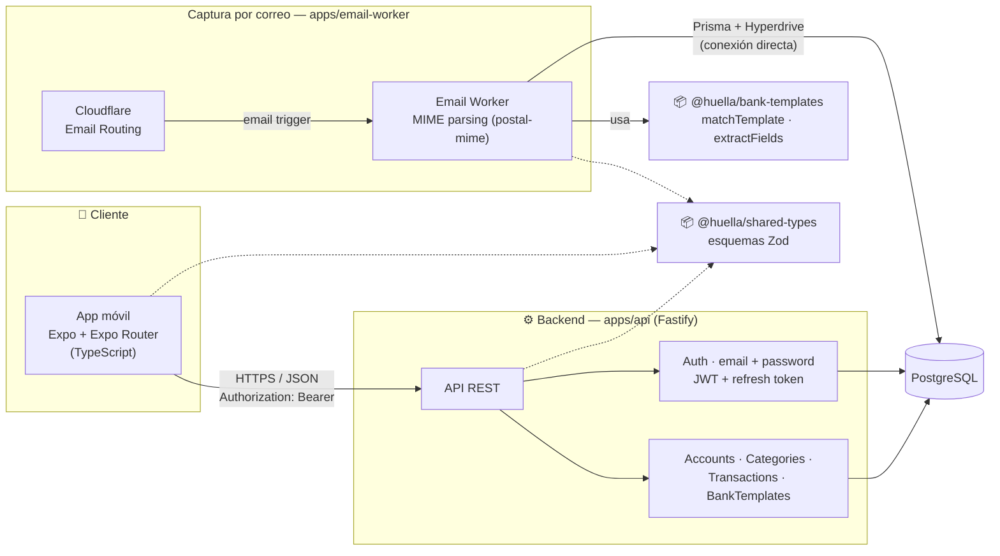

# Arquitectura

Monorepo pnpm con tres apps y tres paquetes compartidos. Este doc expande el diagrama del [README](../README.md#-arquitectura) con el detalle por componente.

## `apps/api` — Fastify

Servidor construido con una factory (`buildServer()` en `src/server.ts`), no una instancia top-level — facilita testear con `fastify.inject()` sin levantar un puerto real (ver `src/routes/*.test.ts`).

**Capas:**
- `src/plugins/` — cross-cutting, envueltos en `fastify-plugin` para que decoren/agreguen hooks visibles a las rutas hermanas registradas después (sin esto, Fastify encapsula cada `register()` en su propio scope aislado):
  - `prisma.ts` — decora `fastify.prisma` con un `PrismaClient`, no bloquea el arranque si la DB no está disponible.
  - `jwt.ts` — registra `@fastify/jwt` con `JWT_SECRET` (falla el arranque si falta), TTL de 15 min para el access token.
  - `require-user.ts` — el hook de autenticación real: valida `Authorization: Bearer <jwt>`, decora `request.userId` a partir del claim `sub`. Se registra un nivel por debajo de la raíz a propósito, para que `/health` y `/auth/*` queden afuera de este scope.
- `src/routes/` — un archivo por recurso (`auth.ts`, `users.ts`, `accounts.ts`, `categories.ts`, `transactions.ts`, `ingestion-events.ts`, `bank-templates.ts`), cada uno un `FastifyPluginAsync` registrado con `{ prefix: "/xxx" }`. Todas las rutas (salvo `/health` y `/auth/*`) leen `request.userId` para scopear sus queries de Prisma por dueño.
- `src/lib/` — helpers chicos y puros: `validate.ts` (`parseOrReject`, valida contra un schema Zod y ya deja la respuesta 400 enviada si falla), `password.ts` (hash/verify con argon2), `refresh-token.ts` (genera/hashea refresh tokens).
- `src/serializers.ts` — traduce el modelo de Prisma (camelCase) al contrato de la API (snake_case, definido por los esquemas Zod de `shared-types`), validando la forma en el proceso.

**Auth:** `POST /auth/register|login` devuelven un access token JWT (15 min) + un refresh token opaco (32 bytes random, se persiste solo su hash SHA-256 en la tabla `refresh_tokens`, TTL 30 días). `POST /auth/refresh` rota el token en cada uso (revoca el viejo, emite uno nuevo) — así un refresh token filtrado tiene una ventana de uso acotada. `POST /auth/logout` lo revoca.

## `apps/mobile` — Expo Router

- `app/` — rutas de Expo Router. `_layout.tsx` envuelve todo en `AuthProvider` y usa `Stack.Protected` para gatear las pantallas autenticadas (`index`, `entry`, `transaction/[id]`) vs las de auth (`login`, `register`) según haya o no sesión.
- `src/auth/session.ts` — store framework-agnostic (no un context de React) sobre `expo-secure-store`, con un mecanismo de subscribe/notify consumible vía `useSyncExternalStore`. Framework-agnostic a propósito: `src/api/client.ts` necesita leer el access token sin importar React, para evitar un ciclo de imports entre la capa de API (usada por toda la app) y un context de React.
- `src/auth/AuthContext.tsx` — `AuthProvider`/`useAuth()`, expone `login`/`register`/`logout` sobre `session.ts`.
- `src/api/client.ts` — el único fetch wrapper (`apiRequest`) que usan todos los módulos de `src/api/*`. Adjunta `Authorization: Bearer` desde la sesión; ante un 401 intenta refrescar el access token una vez (llamando `/auth/refresh` directo, no vía `apiRequest`, para no recursar) y reintenta la request original — si el refresh también falla, limpia la sesión y el gate de `_layout.tsx` redirige a `/login`.

## `apps/email-worker` — Cloudflare Worker

No pasa por la API: Cloudflare Email Routing dispara el worker por cada correo entrante, que resuelve el usuario por el destinatario (`<user_id>@ingest.huella.app`), parsea el MIME con `postal-mime`, usa `@huella/bank-templates` para extraer los campos, y escribe directo a Postgres vía Prisma + Cloudflare Hyperdrive — sin saltar por la API, para evitar un hop de red extra en el camino de ingesta. El handler `email()` nunca deja escapar una excepción: si el parseo falla, igual persiste un `IngestionEvent` sin parsear, así una plantilla de banco corrupta no puede tumbar la ingesta de nadie.

## Paquetes compartidos

- **`packages/shared-types`** — esquemas Zod (snake_case, el contrato de la API) para las 7 entidades núcleo + los payloads de auth. Un archivo por entidad, re-exportado desde `index.ts`.
- **`packages/bank-templates`** — `matchTemplate`/`extractFields`, motor de extracción genérico basado en regex sobre el cuerpo del correo, más las plantillas por banco (hoy: Bancolombia).
- **`packages/db`** — `schema.prisma` + migraciones, compartido entre `apps/api` y `apps/email-worker`. Dos generators de Prisma:
  - `prisma-client-js` (default) — usado por `apps/api`, que corre en Node plano.
  - un generator `workerd` (`engineType = "client"`, sin el motor de queries en Rust) — usado por `apps/email-worker`, porque Cloudflare Workers no puede ejecutar el motor binario clásico de Prisma.

## Build order (por qué importa para CI)

`packages/db` y `packages/shared-types` resuelven sus imports (`@huella/db`, `@huella/shared-types`) vía `dist/` — no hay `paths` mapeando a `src` en los `tsconfig` de quien los consume. Nada tipa, buildea ni testea en el resto del monorepo hasta que esos dos estén compilados, y `packages/db` además necesita `prisma generate` antes de su propio build (genera el client que su código importa). El workflow de CI (`.github/workflows/ci.yml`) sigue exactamente este orden.
